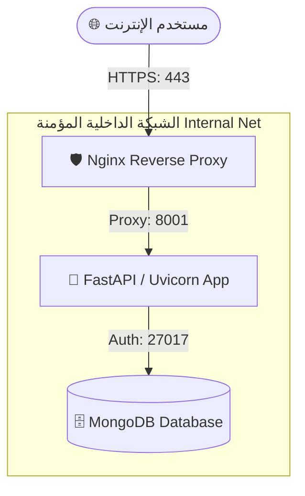

# 📖 دليل النشر والاستضافة لـ نظام المشكاة
> **Mishkaat Quran Center Management System - Production Deployment Guide**

يوفر هذا الدليل التفاصيل الكاملة لنشر نظام المشكاة لإدارة مراكز تحفيظ القرآن الكريم في بيئة الإنتاج (Production) لضمان أعلى مستويات الأمان، والأداء، والاستقرار.

---

## 🏗️ هيكلية النشر الموصى بها (Production Architecture)

نظام المشكاة مُهيأ للعمل بأعلى معايير الأمان التقنية:
- **Nginx**: يعمل كبوابة رئيسية للمتصفح، ويقوم بإنهاء تشفير TLS (SSL)، وضغط الملفات، وإدارة الجلسات الثابتة.
- **FastAPI / Uvicorn (الخادم الخلفي)**: يعمل خلف جدار حماية شبكي داخلي مستقل، ولا يُعرض للإنترنت مباشرة.
- **MongoDB (قاعدة البيانات)**: مغلقة بالكامل داخل الشبكة الافتراضية للخدمات لحماية بيانات الطلاب والمحفظين من أي وصول خارجي.



---

## ⚡ الخيار الأول: النشر التلقائي باستخدام Docker Compose (الخيار الموصى به)

هذا هو الخيار الأسهل والأكثر أماناً، حيث يحتوي النظام على ملف `docker-compose.yml` جاهز ومحمي بالكامل للإنتاج.

### 1️⃣ المتطلبات المسبقة
تأكد من تثبيت الأدوات التالية على الخادم (VPS):
- **Docker** (الإصدار 24+)
- **Docker Compose** (الإصدار 2+)

### 2️⃣ تجهيز ملفات التكوين والبيئة
قم بإنشاء ملف `.env` في المسار الرئيسي للمشروع وضبط القيم السرية التالية:

```env
# بيئة التشغيل
APP_ENV=production
SECRET_KEY=ضع_هنا_سلسلة_عشوائية_طويلة_جداً_ومؤمنة
PII_ENCRYPTION_KEY=ضع_هنا_مفتاح_تشفير_البيانات_الشخصية

# إعدادات قاعدة البيانات (MongoDB)
DB_NAME=quran_center
MONGO_ROOT_USER=admin_db_root
MONGO_ROOT_PASSWORD=كلمة_مرور_جذر_قاعدة_البيانات_السرية
MONGO_APP_USER=mishkaat_app
MONGO_APP_PASSWORD=كلمة_مرور_التطبيق_للاتصال_بالقاعدة
```

> [!IMPORTANT]
> لتوليد `SECRET_KEY` آمن في سطر الأوامر:
> `python -c "import secrets; print(secrets.token_hex(64))"`
> 
> لتوليد `PII_ENCRYPTION_KEY` لتشفير بيانات القاصرين بأمان:
> `python -c "from cryptography.fernet import Fernet; print(Fernet.generate_key().decode())"`

### 3️⃣ بناء الواجهة الأمامية للإنتاج
قبل تشغيل الحاويات، قم ببناء الواجهة الأمامية محلياً أو على الخادم لإنتاج ملفات الويب السريعة والثابتة:
```bash
cd frontend
npm install
npm run build
```
سيقوم هذا بإنشاء مجلد `dist` الذي يحتوي على واجهة المستخدم بعد تطويرها وتجميلها ودعم الوضع الليلي الروحاني فيها.

### 4️⃣ إعداد شهادة الأمان (SSL/TLS) و Nginx
1. ضع ملفات شهادة الأمان (Let's Encrypt) في المجلد `./ops/tls/`:
   - `fullchain.pem`
   - `privkey.pem`
2. قم بتعديل ملف `./ops/nginx.conf` ليتوافق مع اسم النطاق الخاص بك (Domain Name).

### 5️⃣ تشغيل النظام بالكامل بـ أمر واحد
من المجلد الرئيسي للمشروع، نفذ الأمر التالي للتشغيل في الخلفية:
```bash
docker-compose up -d --build
```

---

## 🛠️ الخيار الثاني: النشر اليدوي (Manual Deployment)

إذا كنت تفضل تثبيت الخدمات مباشرة على الخادم دون استخدام Docker.

### 🛠️ الخطوة 1: تهيئة قاعدة بيانات MongoDB
1. قم بتثبيت MongoDB Server على الخادم.
2. تفعيل خيار المصادقة الآمنة (Auth) في ملف `/etc/mongod.conf`:
   ```yaml
   security:
     authorization: enabled
   ```
3. أعد تشغيل الخدمة: `sudo systemctl restart mongod`.

### 🔌 الخطوة 2: تشغيل الخادم الخلفي (FastAPI) باستخدام PM2
1. قم بإنشاء بيئة افتراضية وتثبيت المكتبات:
   ```bash
   cd backend
   python -m venv .venv
   source .venv/bin/activate
   pip install -r requirements.txt
   ```
2. تثبيت مدير العمليات PM2 (يتطلب Node.js):
   ```bash
   sudo npm install -g pm2
   ```
3. تشغيل خادم FastAPI في الخلفية بـ 4 معالجات لتوزيع الحمل الإداري:
   ```bash
   pm2 start "uvicorn server:app --host 0.0.0.0 --port 8001 --workers 4" --name "mishkaat-backend"
   ```
4. لحفظ العمليات للتشغيل التلقائي عند إعادة تشغيل الخادم:
   ```bash
   pm2 save
   pm2 startup
   ```

### 💻 الخطوة 3: نشر الواجهة الأمامية (Vite + React) عبر Nginx
1. قم ببناء ملفات الإنتاج الثابتة:
   ```bash
   cd frontend
   npm run build
   ```
2. انقل محتويات مجلد `dist` الناتج إلى مسار الويب في الخادم (مثال: `/var/www/mishkaat`).
3. قم بتهيئة ملف موقع Nginx في المسار `/etc/nginx/sites-available/mishkaat`:
   ```nginx
   server {
       listen 80;
       listen [::]:80;
       server_name yourdomain.com;
       return 301 https://$server_name$request_uri; # تحويل إجباري إلى HTTPS
   }

   server {
       listen 443 ssl http2;
       server_name yourdomain.com;

       ssl_certificate /etc/letsencrypt/live/yourdomain.com/fullchain.pem;
       ssl_certificate_key /etc/letsencrypt/live/yourdomain.com/privkey.pem;

       # واجهة المستخدم الثابتة
       location / {
           root /var/www/mishkaat;
           try_files $uri $uri/ /index.html;
       }

       # تحويل طلبات الـ API إلى الخادم الخلفي
       location /api {
           proxy_pass http://127.0.0.1:8001;
           proxy_http_version 1.1;
           proxy_set_header Upgrade $http_upgrade;
           proxy_set_header Connection 'upgrade';
           proxy_set_header Host $host;
           proxy_cache_bypass $http_upgrade;
       }
   }
   ```
4. قم بإنشاء رابط رمزي وتنشيط الموقع ثم إعادة تشغيل Nginx:
   ```bash
   sudo ln -s /etc/nginx/sites-available/mishkaat /etc/nginx/sites-enabled/
   sudo systemctl restart nginx
   ```

---

## 🔒 القائمة الأمنية الهامة للإنتاج (Production Security Checklist)

> [!CAUTION]
> لا تتجاوز الخطوات الأمنية التالية قبل فتح النظام للعامة:

- [ ] **تعيين كلمات مرور قوية**: استبدل كافة كلمات المرور الافتراضية (`admin123`, `manager123`) بحسابات وكلمات مرور معقدة جداً.
- [ ] **إخفاء قاعدة البيانات**: تأكد من عدم فتح المنفذ `27017` للعامة في جدار حماية الخادم (UFW / AWS Security Groups).
- [ ] **تشفير PII**: تأكد من عدم تشغيل النظام في الإنتاج بدون تعيين مفتاح `PII_ENCRYPTION_KEY` عشوائي ومحمي جيداً لمنع تسريب بيانات الطلاب.
- [ ] **شهادات الأمان SSL**: تفعيل بروتوكول HTTPS إجبارياً وتشفير كافة الاتصالات.
